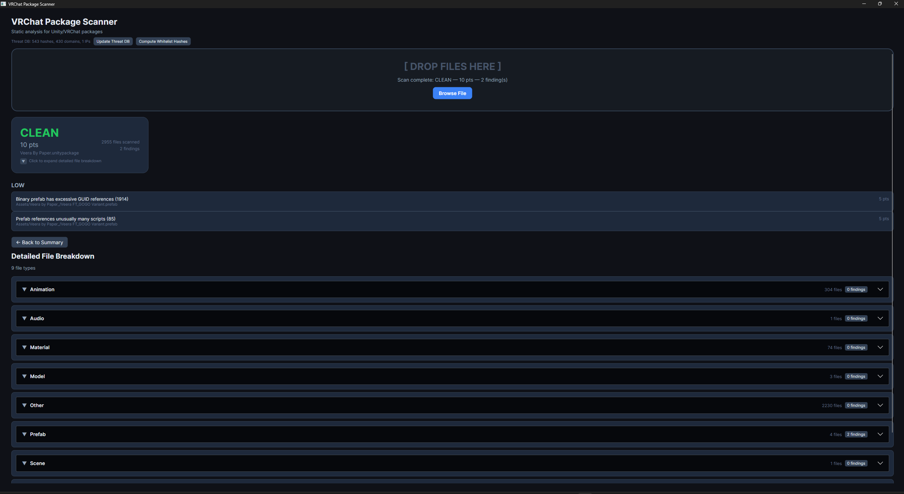

# AssetScanner

A standalone desktop tool for statically analysing Unity/VRChat packages, scripts, and DLLs. Drop a `.unitypackage`, `.zip`, folder, `.cs`, or `.dll` onto the window and get an instant risk report with offline threat-intelligence cross-checks.



## Features

- **Drag & drop** `.unitypackage`, `.zip`, folders, `.cs`, or `.dll` files
- **Static analysis** — no execution required, everything stays local
- **Offline threat intelligence** — cross-references SHA-256 hashes, URLs, and IPs against downloaded databases (MalwareBazaar, URLhaus, Feodo Tracker)
- **UnityPackage extraction** — handles modern ZIP-format and legacy gzip+tar `.unitypackage` files, plus plain ZIP archives
- **C# script analysis** — detects dangerous APIs (`Process.Start`, `Assembly.Load`, `DllImport`, `Reflection.Emit`, etc.), obfuscation patterns, and suspicious URLs/IPs
- **DLL / PE analysis** — custom lightweight PE parser that inspects imports, sections, and entropy
- **Whitelist system** — exact SHA-256 hash matching for popular legitimate packages (Poiyomi Toon, VRCFury, PumkinsAvatarTools, GoGoLoco). Modified files fall back to obfuscation-only analysis instead of being blindly trusted
- **Detailed file breakdown** — click the score card after a scan to see every file grouped by type with individual findings

## Supported Formats

| Format | Notes |
|--------|-------|
| `.unitypackage` | Modern (ZIP) and legacy (gzip+tar) |
| `.zip` | Plain archives or UnityPackage-wrapped |
| Folders | Recursively scanned |
| `.cs` | Individual C# script files |
| `.dll` | PE/DLL analysis |

## Building

Requires [.NET 8 SDK](https://dotnet.microsoft.com/download/dotnet/8.0).

```bash
dotnet build AssetScanner.sln
```

Run the desktop app:

```bash
dotnet run --project AssetScanner.Desktop
```

Or launch the built executable directly:

**Windows**
```bash
AssetScanner.Desktop/bin/Release/net8.0/AssetScanner.Desktop.exe
```

**Linux / macOS**
```bash
AssetScanner.Desktop/bin/Release/net8.0/AssetScanner.Desktop
```

> **Note:** Drag-and-drop from Explorer is blocked if the app is running as Administrator (e.g., when launched from Visual Studio elevated). Run the `.exe` directly from Explorer for drag-and-drop to work.

## CI / CD

Every push to `main`, `master`, or `develop` triggers a build for **Windows (x64)**, **Linux (x64)**, and **macOS (x64 & ARM64)** via GitHub Actions.

| Trigger | Platforms | Artifacts |
|---------|-----------|-----------|
| Push / PR | win-x64, linux-x64, osx-x64 | ZIP per platform |
| Version tag (`v*`) | win-x64, linux-x64, osx-x64, osx-arm64 | Draft GitHub Release with all ZIPs |

No local .NET runtime is required — the published binaries are **self-contained single-file executables**.

## Architecture

```
AssetScanner/
  Config/           Scanner constants, whitelist data, whitelist checker
  Ingestion/        UnityPackage / ZIP / folder extraction
  Analysis/
    Scripts/          C# script analyser, obfuscation detector
    Dll/            Custom PE parser, DLL analyser
  Models/           Core enums and data models (Finding, FileRecord, etc.)
  Pipeline/           ScanPipeline orchestration
  Reporting/        ScanReport generation
  Scoring/          Risk score calculation
  ThreatIntel/      Offline threat database download & lookup
  Utils/            Compiled regex patterns

AssetScanner.Desktop/
  ViewModels/         Avalonia MVVM layer
  Converters/         Colour converters for severity/risk levels
  MainWindow.axaml    UI layout
```

## Threat Intelligence

The tool downloads and caches the following public feeds locally (no file uploads):

- **MalwareBazaar** — SHA-256 hashes of known malware
- **URLhaus** — malicious URLs and domains
- **Feodo Tracker** — IP blocklist of C2 servers

Click **Update Threat DB** in the app header to refresh the databases.

## Whitelist Security

The whitelist uses **exact SHA-256 hash matching**, not just file-name matching. If a file matches a whitelist entry by path but the hash does not match, it is treated as **Modified** (obfuscation-only analysis) rather than being fully trusted. This prevents attackers from renaming malicious files to bypass detection.

To generate hashes for a new known-good package, click **Compute Whitelist Hashes** in the app header, select the package or folder, and paste the generated C# code into `AssetScanner/Config/WhitelistData.cs`.

## External Sources & Credits

### Whitelisted Packages
SHA-256 hashes for the following popular Unity/VRChat packages are included in the built-in whitelist:

| Package | Author | Source |
|---------|--------|--------|
| **Poiyomi Toon** | poiyomi | Popular Unity toon shader package |
| **VRCFury** | VRCFury | [github.com/VRCFury/VRCFury](https://github.com/VRCFury/VRCFury) |
| **PumkinsAvatarTools** | rurre | [github.com/rurre/PumkinsAvatarTools](https://github.com/rurre/PumkinsAvatarTools) |
| **GoGoLoco** | Spokeek | [github.com/Spokeek/goloco](https://github.com/Spokeek/goloco) |

### Threat Intelligence Feeds
The following free, public security feeds are used for offline cross-referencing:

| Feed | Provider | URL |
|------|----------|-----|
| **MalwareBazaar** | abuse.ch | [bazaar.abuse.ch](https://bazaar.abuse.ch) |
| **URLhaus** | abuse.ch | [urlhaus.abuse.ch](https://urlhaus.abuse.ch) |
| **Feodo Tracker** | abuse.ch | [feodotracker.abuse.ch](https://feodotracker.abuse.ch) |

### Frameworks & Libraries
- **[Avalonia UI](https://avaloniaui.net/)** — Cross-platform .NET UI framework used for the desktop application
- **.NET 8** — Target runtime and SDK

## License

MIT
